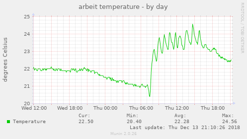
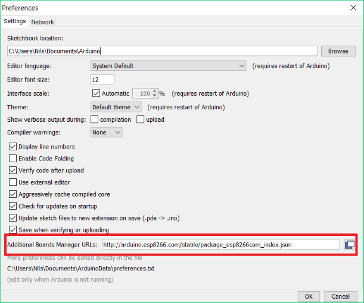
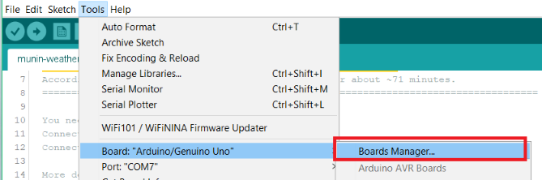
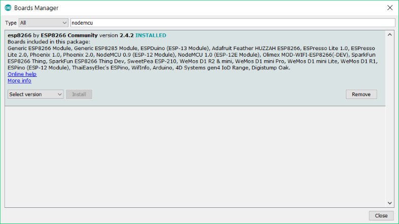
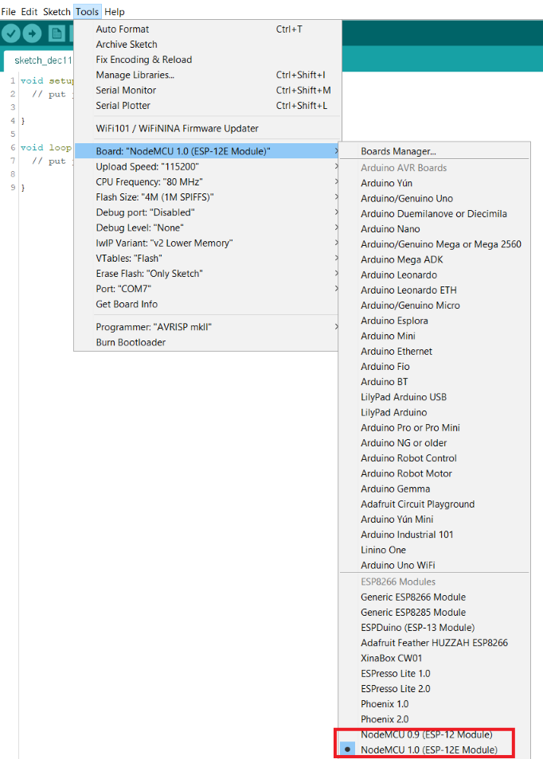
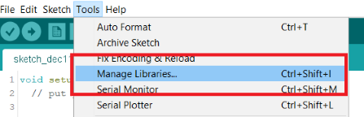
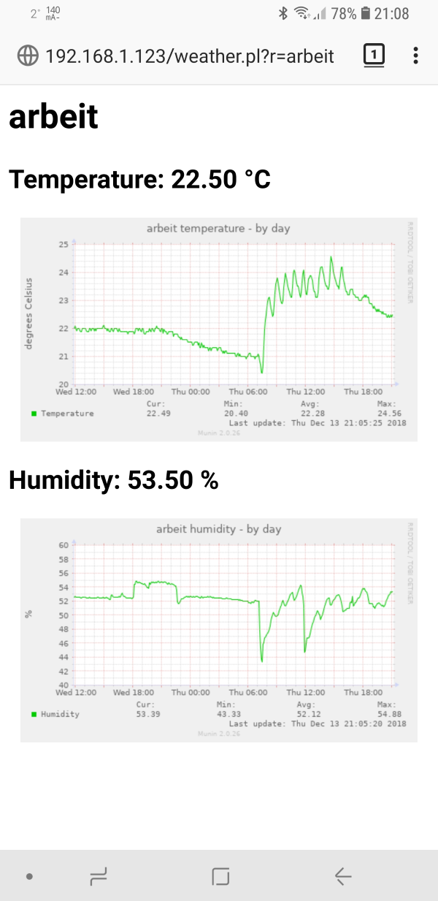

# IoT Weather Station for Munin



## How does it work?

* The ESP8266 connects itself via WiFi and gets by DHCP an IP address
* Sensor data is sent via HTTP to the defined server
* Munin creats RRD file and nice graph

```
     +---------+                      +--------------+
     | ESP8266 |                      + Munin-Master |
      \ DHT22 /                       +--------------+
       +-----+                               |
          | send                       fetch |
          v                                  v
 +--------------------------+  +--------------------------+
 + HTTP server / weather.pl |  | Munin-Node / weather_.pl |
 +--------------------------+  +--------------------------+
        |                                          |
        +- write -> [ text file storage ] <- read -+
```

## Requirements

You need:

* One ESP8266
    * I use the `NodeMCU Lua Lolin V3 Module`
* One DHT22 sensor
* A few cables to connect everything

Besides, you need:

* HTTP server with CGI support
* A working Munin installation

## Set-Up

A Raspberry Pi is suitable for the HTTP servers and Munin-Master.
So if you haven't installed Munin yet just follow these steps.

### Preparation

Create a folder where the sensor data will be saved temporarily.

```
mkdir "/var/lib/weather"
chmod 777 "/var/lib/weather"
```

Edit `$store` in the scripts `weather.pl` and `weather_.pl` to  this location. 

### HTTP Server - Lighttpd

Lighttpd is an excellent web server.
It consumes much less resources than Apache and is therefore ideal for our set-up.

Install:

```
apt-get install lighttpd
```

Config:

```
nano -w /etc/lighttpd/lighttpd.conf
```

Enable `mod_cgi`:

```
server.modules = (
    # Add this
    "mod_cgi",
)
```

Assign `*.pl` to Perl:

```
static-file.exclude-extensions = ( ".php", ".pl", ".fcgi", ".sh" )
cgi.assign = ( ".pl" => "/usr/bin/perl")
```

#### CGI Script

Copy `weather.pl` to root folder of the web server:

```
chmod +x "weather.pl"
cp "weather.pl" "/var/www/html/"
```

### Munin

Install:

```
apt-get install munin munin-node
```

Config:

```
nano -w /etc/munin/munin.conf
```

Add local Munin-Node (maybe this was already done automatically during the installation):

```
# Hosts
[localhost]
    address localhost
    port 2424
    use_node_name yes
```

#### Munin Plugin

Copy `weather_.pl` to Munin plugin folder:

```
chmod +x "weather_.pl"
cp "weather_.pl" "/usr/lib/munin/plugins/"
```

Now create a symbolic link for each weather station:

```
ln -sf "/usr/lib/munin/plugins/weather_.pl" "/etc/munin/plugins/weather_<NAME>_celsius"
ln -sf "/usr/lib/munin/plugins/weather_.pl" "/etc/munin/plugins/weather_<NAME>_humidity"
```

The name (`<NAME>`) is important and must be exactly the same as when flashing the ESP8266 later on.

Restart:

```
service munin-node restart
```

#### Multiple Sensors

If you want to see the temperature of multiple sensors in one graph edit `munin.conf` and add:

```
# example for side by side graph
[weather;indoor]
        update no
        contacts no
        weather_indoor_celsius.update no
        weather_indoor_celsius.graph_category sensors
        weather_indoor_celsius.graph_title indoor temperature
        weather_indoor_celsius.graph_vlabel degrees Celsius
        weather_indoor_celsius.graph_args --base 1000
        weather_indoor_celsius.graph_scale no
        weather_indoor_celsius.graph_order \
                Arbeitszimmer=localhost;localhost:weather_arbeit_celsius.weather_arbeit_celsius \
                Kueche=localhost;localhost:weather_kueche_celsius.weather_kueche_celsius \
                Wohnzimmer=localhost;localhost:weather_wohnzimmer_celsius.weather_wohnzimmer_celsius
```

### ESP8266

Depending on the ESP8266 board, you may need to install USB drivers.
The driver for NodeMCU USB chip can be found on the [Silicon Labs website](https://www.silabs.com/products/development-tools/software/usb-to-uart-bridge-vcp-drivers).

The programming is done with the [Arduino IDE](https://www.arduino.cc/en/Main/Software). If you do not have it yet, install it.

Add in Preferences the "Additional Boards Manager URL":
`http://arduino.esp8266.com/stable/package_esp8266com_index.json`



Open "Boards Manager" and install `esp8266`





Select the right board:



#### Libraries

Install:

* DHT sensor library 
* Adafruit Unified Sensor



#### Wiring

Connect the DHT22 data pin to `D6`.

```
  _______
 /  ( )  \
 +-------+
 | [] [] |
 | [] [] |
 | [] [] |
 +-------+
  | | | |
  
   \ \ \ \__ Ground: Connect it to GND
    \ \ \___ Nothing
     \ \____ Data pin: Connect it to D6
      \_____ Positive pin: Connect it to 3v3
```

#### Program

Open `iot-weather-munin.ino` with the Arduino IDE and adjust the configuration:

* `name`     : Name of the weather station (at least 3 characters up to 15 characters a-zA-Z0-9)
* `server`   : HTTP server with `weather.pl` CGI script
* `ssid`     : Your WiFi SSID
* `password` : Your WiFi password

Upload `iot-weather-munin.ino` to your ESP8266.

#### Deep Sleep 💤

The code is optimized for low power consumption as well as battery operation.
ESP8266 goes into deep sleep.
After flashing connect PIN `D0` to `RST`.

## Tip

The Perl CGI script `weather.pl` can not only store the data.
The script can also output a small web page with the data.

URL: `http://<SERVER-IP>/weather.pl?r=<NAME>`



## Help 👍

If you have found a bug (English is not my mother tongue) or have any improvements, send me a pull request.